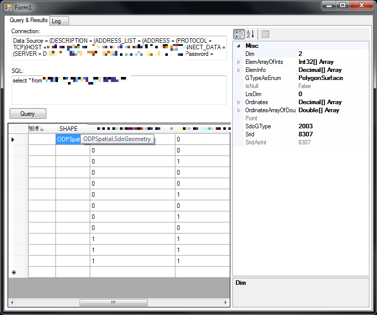

# hello.ODPSpatial

A quick sample on how to use Oracle Spatial with .NET and compact xcopy-deployment with Instant Client only. It implements [SdoPoint](http://docs.oracle.com/cd/E11882_01/appdev.112/e11830/sdo_objrelschema.htm#i1009746), [SdoGeometry](http://docs.oracle.com/cd/E11882_01/appdev.112/e11830/sdo_objrelschema.htm#i1009746) and [StGeometry](http://docs.oracle.com/cd/E11882_01/appdev.112/e11830/sdo_sql_mm.htm#CHDJHAFA). Credits to [Deploying ODP.NET with Oracle Instant Client](http://alderprogs.blogspot.de/2009/04/deploying-odpnet-with-oracle-instant.html) (Blogpost).

For deployment you need 

- [Instant Client (Basic Lite)](http://www.oracle.com/technetwork/database/features/instant-client/index.html), 
- the .NET Assembly `Oracle.DataAccess` and the native `OraOps11w.dll` (extracted from [ODAC](http://www.oracle.com/technetwork/developer-tools/visual-studio/downloads/index-101290.html), ~1.4 MB).

Hier is a screenshot of the sample application.

